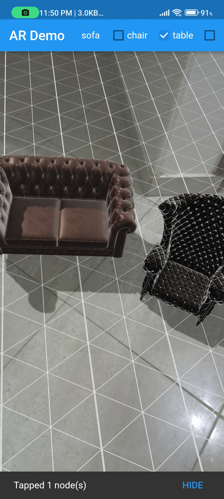
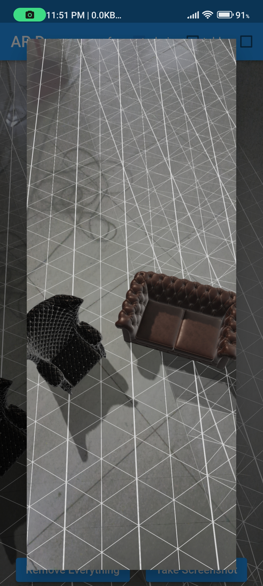

# AR Template

* Flutter 3.3.8

* [Click see video](https://youtu.be/J1smBxPNpUc)


## images
</img>
</img>

## Getting Started

A AR Template project created in flutter using Bloc . AR Template supports mobile, clone the appropriate branches mentioned below:

The AR Template Is Augmented reality With Flutter Demo

## How to Use 

**Step 1:**

Download or clone this repo by using the link below:

```
git clone https://github.com/the-best-is-best/ar_template.git
```


**Step 2:**

Go to project root and execute the following command in console to get the required dependencies: 

```
flutter pub get 
```
